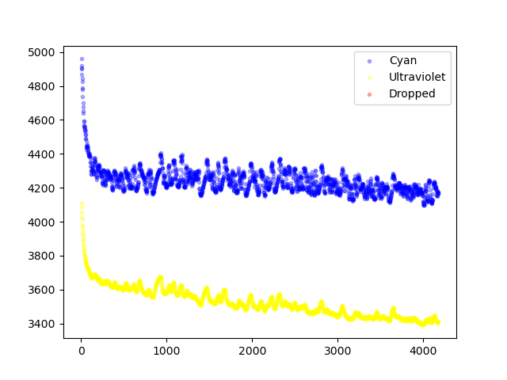
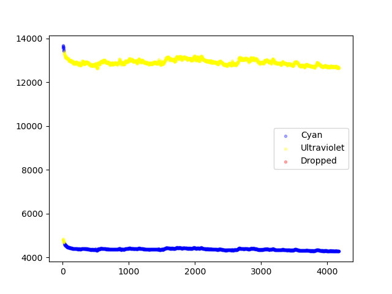
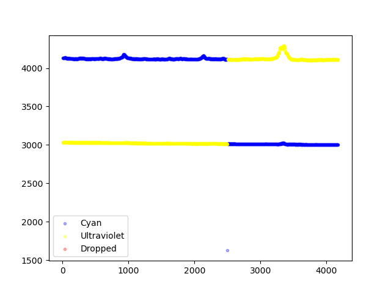
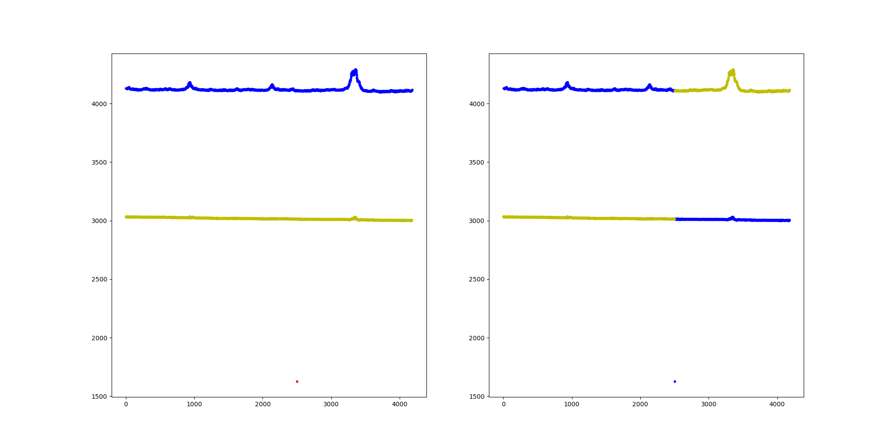
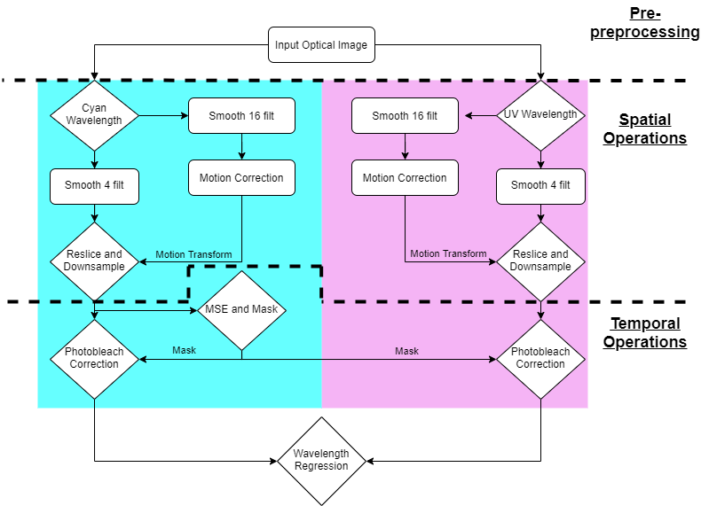

# Calcium Scripts
## A guide to taking two wavelength widefield optical imaging data through some quality control and preprocessing steps

## Installation

### Python Environment
If you want to use the python scripts you need to install python and have the packages detailed in installationFile/environment.txt installed as well. The easiest way to do this, is to install [miniconda](https://docs.conda.io/en/latest/miniconda.html), and then use the command:

```
conda install --file environment.txt
```

### MATLAB
For the script smrToMat.py, a MATLAB installation is needed.

### BIS integrated preprocessing pipeline
For the time being, the easiest way to use the preprocessing pipeline is to do so via a singularity image. 

First you need to install [singularity](https://singularity.hpcng.org/user-docs/master/quick_start.html)

Then you can download this [file](https://drive.google.com/file/d/1H7PIvLk06wPqgDPYvIvD4HHfqPf2lkAm/view?usp=sharing) or build the image using the specification file in install/thing.txt and run the following command:

```
singularity build ubuntuBIS.sif ../biswebSing.recipe
```

Once you have the image either downloaded or built you can proceed with the run instructions.

## Running the code

### Input data (tif files and smr files)
First the data should be in a BIDs like format (but not quite), for now the scripts enclosed only support the following directory structure:

```
SLC/
SLC/ses-2
SLC/ses-2/animal06
SLC/ses-2/animal06/ca2
SLC/ses-2/animal06/ca2/SLC_animal06_ses-2_2019-01-17_EPI1_REST_part-00.tif
SLC/ses-2/animal06/ca2/SLC_animal06_ses-2_2019-01-17_EPI1_REST_part-01.tif
SLC/ses-2/animal06/ca2/SLC_animal06_ses-2_2019-01-17_EPI1_REST_part-02.tif
SLC/ses-2/animal06/ca2/SLC_animal06_ses-2_2019-01-17_EPI2_LED_part-00.tif
SLC/ses-2/animal06/ca2/SLC_animal06_ses-2_2019-01-17_EPI2_LED_part-01.tif
SLC/ses-2/animal06/ca2/SLC_animal06_ses-2_2019-01-17_EPI2_LED_part-02.tif
SLC/ses-2/animal06/ca2/SLC_animal06_ses-2_2019-01-17_EPI3_REST_part-00.tif
SLC/ses-2/animal06/ca2/SLC_animal06_ses-2_2019-01-17_EPI3_REST_part-01.tif
SLC/ses-2/animal06/ca2/SLC_animal06_ses-2_2019-01-17_EPI3_REST_part-02.tif
SLC/ses-2/animal06/ca2/SLC_animal06_ses-2_2019-01-17-16-06-51_619.smr
SLC/ses-2/animal06/ca2/SLC_animal06_ses-2_2019-01-17-16-35-57_621.smr
SLC/ses-2/animal06/ca2/SLC_animal06_ses-2_2019-01-17-16-58-16_623.smr

```

Essentially the code expects data in the following pseudo format, for Tif Files: 
```
{datasetName}/ses-{sessionLabel}/{subID}/ca2/{datasetName}_{subID}_ses-{sessionLabel}_{date}_{runNumber}_{taskLabel}_part-{partNumber}.tif
```
and for electrical recording files: 
```
{datasetName}/ses-{sessionLabel}/{subID}/ca2/{datasetName}_{subID}_ses-{sessionLabel}_{dateAndTime}.mat
```

The scripts are overly prescritptive at the moment, but will be made more general with time. You can fill in dummy variables if needed.


### Splitting wavelengths

Now we cam start buidling a directory containing nifti files and csvs, corresponding to the wavelength specific data and trigger timing respectively. The following commands will aid us:

```
python smrToMat.py organizedData/

python genTrigsNii.py organizedData/ preprocDir/ qcFigs/ triggerFix.csv

```

The first command will convert smr files to mat files. The will have the same names as the smr files, with a different file extension. Mat files can be read by python. The second command will try to split out the tif files into "signal" and "noise" automatically. If the automatic split is successful, the code will write nifti and csv data in the output directory in the following format: 

```
preprocDir/SLC
preprocDir/SLC/ses-2
preprocDir/SLC/ses-2/animal06
preprocDir/SLC/ses-2/animal06/ca2
preprocDir/SLC/ses-2/animal06/ca2/SLC_animal06_ses-2_2019-01-17_EPI1_REST
preprocDir/SLC/ses-2/animal06/ca2/SLC_animal06_ses-2_2019-01-17_EPI1_REST/part-00
preprocDir/SLC/ses-2/animal06/ca2/SLC_animal06_ses-2_2019-01-17_EPI1_REST/part-00/OpticalOrder.csv
preprocDir/SLC/ses-2/animal06/ca2/SLC_animal06_ses-2_2019-01-17_EPI1_REST/part-00/rawsignl.nii.gz
preprocDir/SLC/ses-2/animal06/ca2/SLC_animal06_ses-2_2019-01-17_EPI1_REST/part-00/rawnoise.nii.gz
preprocDir/SLC/ses-2/animal06/ca2/SLC_animal06_ses-2_2019-01-17_EPI1_REST/part-01
preprocDir/SLC/ses-2/animal06/ca2/SLC_animal06_ses-2_2019-01-17_EPI1_REST/part-01/OpticalOrder.csv
preprocDir/SLC/ses-2/animal06/ca2/SLC_animal06_ses-2_2019-01-17_EPI1_REST/part-01/rawsignl.nii.gz
preprocDir/SLC/ses-2/animal06/ca2/SLC_animal06_ses-2_2019-01-17_EPI1_REST/part-01/rawnoise.nii.gz
preprocDir/SLC/ses-2/animal06/ca2/SLC_animal06_ses-2_2019-01-17_EPI1_REST/part-02
preprocDir/SLC/ses-2/animal06/ca2/SLC_animal06_ses-2_2019-01-17_EPI1_REST/part-02/OpticalOrder.csv
preprocDir/SLC/ses-2/animal06/ca2/SLC_animal06_ses-2_2019-01-17_EPI1_REST/part-02/rawsignl.nii.gz
preprocDir/SLC/ses-2/animal06/ca2/SLC_animal06_ses-2_2019-01-17_EPI1_REST/part-02/rawnoise.nii.gz
```

As well as this, there will be quality control figures present in the quality control (qcFigs) directory. You should look at each of these to ensure that the automatic split worked appropriately. Below are two examples, one correct, one incorrect, of "successfully split" data. For the incorrect example, you should use the semi automated functions detailed later.

Correct           |  Incorrect
:-------------------------:|:-------------------------:
  |  

If an image cannot be be split automatically, there will not be any corresponding files in the output directory. However, there are semi-automatic features that can split the image
with your supervision. Upon first pass of the data the code will create a spreadsheet (named as you have specified), in this case "triggerFix.csv". The spreadsheet will be populated with the names of the files in your input directory automatically, and will look something like this:

| Img                                             |   CrossedTrigs |   autoFix |   simpFix |   sdFlag |   sdVal |   writeImgs |   manualOverwrite |   splitMethod |   dbscanEps |
|:------------------------------------------------|---------------:|----------:|----------:|---------:|--------:|------------:|------------------:|--------------:|------------:|
| SLC_animal06_ses-2_2019-01-17_EPI1_REST_part-00 |                |           |           |          |         |             |                   |               |             |
| SLC_animal06_ses-2_2019-01-17_EPI1_REST_part-01 |                |           |           |          |         |             |                   |               |             |
| SLC_animal06_ses-2_2019-01-17_EPI1_REST_part-02 |                |           |           |          |         |             |                   |               |             |
| SLC_animal06_ses-2_2019-01-17_EPI2_LED_part-00  |                |           |           |          |         |             |                   |               |             |
| SLC_animal06_ses-2_2019-01-17_EPI2_LED_part-01  |                |           |           |          |         |             |                   |               |             |
| SLC_animal06_ses-2_2019-01-17_EPI2_LED_part-02  |                |           |           |          |         |             |                   |               |             |
| SLC_animal06_ses-2_2019-01-17_EPI3_REST_part-00 |                |           |           |          |         |             |                   |               |             |
| SLC_animal06_ses-2_2019-01-17_EPI3_REST_part-01 |                |           |           |          |         |             |                   |               |             |
| SLC_animal06_ses-2_2019-01-17_EPI3_REST_part-02 |                |           |           |          |         |             |                   |               |             |


You can edit this spreadsheet to help fix the data. 
- For any data that could not be split automatically the code will put a "1" in the "CrossedTrigs" column next to the filename. 
- The code will generate a first pass at two different methods for generating wavelegnth labels for the data based on the mean timeseries of the tif file. 
  - The "simpFix" method assumes that the wavelengths were acquired in a simple interleaved fashion, without any error: cyan,uv,cyan,uv.... etc. 
  - The second method (autoFix) is useful in the case that there is a skipped frame at some point (in which case the order of the wavelengths will swap at some point). It is based on the mean intensity of each frame, and assumes that there are two distributions of data (cyan and uv) with significantly different means. In this case it will assign all frames in the distribution with the higher mean intensity to cyan, and the lower inensity to uv. 
- The code will generate plots of both methods applied to the data and deposit them in the quality control directory, in this case called qcFigs/triggerFix/ (autogenerated). 
- You can look at these and if either the auto fix or the simp fix gives satisfactory results you can then put a "1" in the "writeImgs" column in the spreadsheet, rerun the code and the nifti files will be written to the output directory.

Data with dropped trigger:

 

Proposed fixes (autoFix vs simpFix):




For example in the above image, if you are happy with the autoFix solution, you can edit the csv file like so:

|    | Img                                             |   CrossedTrigs |   autoFix |   simpFix |   sdFlag |   sdVal |   writeImgs |   manualOverwrite |   splitMethod |   dbscanEps |
|---:|:------------------------------------------------|---------------:|----------:|----------:|---------:|--------:|------------:|------------------:|--------------:|------------:|
|  0 | SLC_animal06_ses-2_2019-01-17_EPI1_REST_part-00 |        1       |     1     |           |          |         |     1       |                   |               |             |

Then rerun the code, and the data will output with the correct split of cyan and uv. 

Addional notes:
- 

- The autoFix method works off of the distribution of the data, but can be thrown off if the cyan and uv distributions are far in terms of mean magnitude and artifactual frame is relatively close, or vice versa. In one of these cases you can put a "1" in the sdFlag column, and then enter a value in the sdVal column. The default sdVal is 8, a higher value will include artifactual frames which have relatively high/low magnitudes, and a lower value will exlcude those with magnitudes closer to the non-artifactual dat.
If the data is too challenging to split using the above methods, it is possible to manually create a trigger file. You can put it is this directory:

- Under the directory the folder structure should be similar to the output directory. In this case the file will be copied into the output directory, provided there is a one in the "manualOverwrite" column.

- The splitMethod and dbscanEps columns are part of a function that is under development, please ignore. 

### Preprocessing

The preprocessing code is currenty best used as a singularity container. It is available for download [here](https://drive.google.com/file/d/1H7PIvLk06wPqgDPYvIvD4HHfqPf2lkAm/view?usp=sharing) 

The pipeline will perform the functions detailed in the figure below:



It can be used as follows:

```
singularity exec ubuntuBIS.simg python3 calciumPreprocess2.py --signal rawsignl.nii.gz --noise rawnoise.nii.gz --signalout signl_out.nii.gz --noiseout dnoise_out.nii.gz --debug True --workdir workdir/ --runoption spatial --createmask False --createmcref True --mask mask.nii.gz
```

The arguments are detailed here:

| Argument    | Required                                      | Type    | Description                                                                                                |
|:------------|:----------------------------------------------|:--------|:-----------------------------------------------------------------------------------------------------------|
| signal      | True                                          | String  | Cyan nifti file                                                                                            |
| noise       | True                                          | String  | UV nifti file                                                                                              |
| signalout   | True                                          | String  | Output filepath for preprocessed cyan                                                                      |
| noiseout    | True                                          | String  | Output filepath for preprocessed uv                                                                        |
| debug       | False                                         | Boolean | If True, will output all intermediate files                                                                |
| workdir     | True                                          | String  | Path to put intermediate files                                                                             |
| runoption   | True                                          | String  | Can be one of “spatial”, “temporal” or “both”                                                              |
| createmask  | True                                          | Boolean | If True will try automated creation of mask                                                                |
| createmcref | True                                          | Boolean | If True will take middle frame of raw cyan as motion correction reference                                  |
| mask        | True if createmask is false; otherwise false  | String  | If createmask is False, give path to other mask. Not needed if runoption is only spatial                   |
| mcrefsignal | True if createmcref is false; otherwise false | String  | If createmcref is False, give path to nifti file with frame to use as motion correction reference for cyan |
| mcrefnoise  | True if createmcref is false; otherwise false | String  | If createmcref is False, give path to nifti file with frame to use as motion correction reference for uv   |

And here is a description of the outputs:

| File                                              | Group                     | Description                                           |
|:--------------------------------------------------|:--------------------------|:------------------------------------------------------|
| rawsignl.nii.gz                                   | Raw Data                  | Raw cyan data                                         |
| rawnoise.nii.gz                                   | Raw Data                  | Raw uv data                                           |
| opticalOrder.csv                                  | Raw Data                  | Trigger timing                                        |
| rawsignl_moco_refimg.nii.gz                       | Raw Data                  | Middle frame from raw cyan                            |
| rawsignl_smooth16.nii.gz                          | Spatial Operation Output  | Cyan data smoothed with median kernel of size 16      |
| rawnoise_smooth16.nii.gz                          | Spatial Operation Output  | Uv data smoothed with median kernel of size 16        |
| rawsignl_smooth4.nii.gz                           | Spatial Operation Output  | Cyan data smoothed with median kernel of size 4       |
| rawnoise_smooth4.nii.gz                           | Spatial Operation Output  | Uv data smoothed with median kernel of size 4         |
| rawsignl_smooth16_moco.nii.gz                     | Spatial Operation Output  | Motion corrected smooth16 data                        |
| rawsignl_smooth16_moco_refimg.nii.gz              | Spatial Operation Output  | Middle frame from motion corrected smooth16 data      |
| rawsignl_smooth16_moco_xfm.npy                    | Spatial Operation Output  | Motion correction parameters                          |
| rawnoise_smooth16_moco.nii.gz                     | Spatial Operation Output  | Motion corrected smooth16 data                        |
| rawnoise_smooth16_moco_refimg.nii.gz              | Spatial Operation Output  | Middle frame from motion corrected smooth16 data      |
| rawnoise_smooth16_moco_xfm.npy                    | Spatial Operation Output  | Motion correction parameters                          |
| rawsignl_smooth4_mococombo.nii.gz                 | Spatial Operation Output  | Motion correction parameters applied to smooth4 data  |
| rawnoise_smooth4_mococombo.nii.gz                 | Spatial Operation Output  | Motion correction parameters applied to smooth4 data  |
| signl_out.nii.gz                                  | Spatial Operation Output  | Output of spatial operations                          |
| noise_out.nii.gz                                  | Spatial Operation Output  | Output of spatial operations                          |
| rawsignl_smooth4_mococombo_threeparts.nii.gz      | Spatial Operation Output  | The stitched together data from three parts of an EPI |
| rawnoise_smooth4_mococombo_threeparts.nii.gz      | Spatial Operation Output  | The stitched together data from three parts of an EPI |
| rawsignl_smooth4_mococombo_photob.nii.gz          | Temporal Operation Output | Photobleach corrected cyan                            |
| rawnoise_smooth4_mococombo_photob.nii.gz          | Temporal Operation Output | Photobleach corrected uv                              |
| rawsignl_smooth4_mococombo_photob_wvlthreg.nii.gz | Temporal Operation Output | Cyan with uv regressed out                            |
| signl_out.nii.gz                                  | Temporal Operation Output | Output of temporal operations                         |
| noise_out.nii.gz                                  | Temporal Operation Output | Output of temporal operations                         |

There is a script cal runPreproc.py to provide easy preprocessing of the bids like directory output from genTrigs.py. It requires the following:

- An preprocessing directory setup like above.
- A path to premade masks. The files should be named like: {datasetName}_{subID}_ses-{sessionLabel}_RotOptical_maskRPI.nii.gz
- The singularity image file


And can be used like so:
```
python3 runPreproc.py preprocDir/ maskDIr/ ubuntuBIS.sif
```

The way the data is setup at the moment, it is required that we do spatial prepreprocessing first, then stitch together three image parts, and do temporal processing. This script will perform these operations sequentially. 

